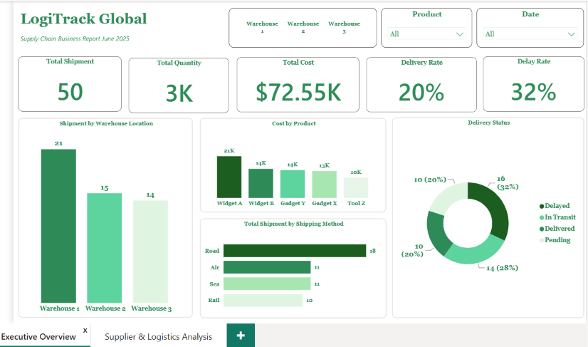
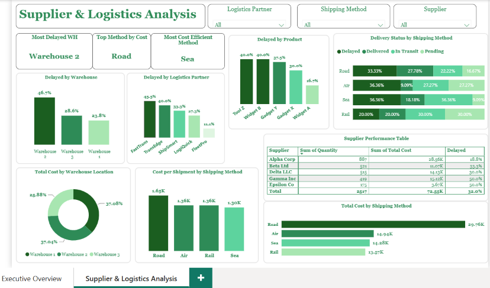

# LogiTrack Global: Supply Chain & Logistics Performance Analysis

**Tool:** Power BI | **Type:** Independent project | **Data:** Kaggle — Supply Chain Logistics Dataset

An interactive two-page Power BI dashboard analyzing delivery reliability, supplier performance, and cost efficiency for a simulated logistics company, built to answer seven core business questions and surface actionable recommendations for management.

---

## 📌 Business Problem

LogiTrack Global is a mid-sized logistics and supply chain company managing product distribution across multiple warehouses, suppliers, and logistics partners. Despite strong operational activity, delivery reliability, partner performance, and cost efficiency had become growing concerns for management — but there was no single, data-driven view of what was actually driving these problems.

**My role:** analyze the company's supply chain data, build an interactive Power BI dashboard, and deliver actionable insights and recommendations to support better operational decisions.

---

## 🗂️ Dataset

- **Source:** [Supply Chain Dataset, Kaggle](https://www.kaggle.com/datasets/discovertalent143/supply-chain-dataset) (synthetic data)
- **Records:** 50 shipment transactions
- **Period:** June 2025
- **Fields:** Product, Supplier, Warehouse Location, Quantity, Unit Price, Total Cost, Delivery Date, Logistics Partner, Shipping Method, Delivery Status

---

## 🛠️ Approach

1. **Clean** — Loaded and cleaned the dataset in Power Query: validated data types, formatted the delivery date for time intelligence, and flagged a Delivery Performance status per shipment.
2. **Model** — Built core DAX measures (Total Shipments, Total Quantity, Total Cost, Delivery Success Rate, Delay Rate) plus derived measures for cost efficiency and top-performer KPIs.
3. **Visualize** — Designed a two-page dashboard: an Executive Overview for headline metrics, and a Supplier & Logistics Analysis page for deeper diagnostic detail.
4. **Recommend** — Investigated patterns across warehouses, suppliers, shipping methods, and logistics partners to surface insights and translate them into concrete recommendations.

---

## 📊 Dashboard Preview

### Page 1 — Executive Overview

High-level KPIs (shipments, quantity, cost, delivery rate, delay rate) alongside shipment volume by warehouse, cost by product, shipment mix by shipping method, and overall delivery status.

### Page 2 — Supplier & Logistics Analysis

Drill-down analysis of delay drivers by warehouse, supplier, logistics partner, and product; cost efficiency by shipping method; a full supplier performance table; and delivery-status patterns by shipping method. Both pages are fully cross-filterable — selecting any slicer on either page filters both.

---

## ❓ Business Questions Answered

| # | Question | Answered On |
|---|----------|-------------|
| 1 | What is the overall delivery success rate across all shipments? | Page 1 (KPI card) |
| 2 | Which logistics partner has the highest delay rate? | Page 2 — Delayed by Logistics Partner |
| 3 | Which supplier is associated with the most delayed shipments? | Page 2 — Supplier Performance Table |
| 4 | Which shipping method is most cost efficient? | Page 2 — Cost per Shipment by Shipping Method |
| 5 | Which warehouse handles the highest value of shipments? | Page 2 — Total Cost by Warehouse Location |
| 6 | Which product generates the most total shipment cost? | Page 1 — Cost by Product |
| 7 | Are there any patterns between shipping method and delivery status? | Page 2 — Delivery Status by Shipping Method |

---

## 💡 Key Insights

1. **Delay rate is critically high and concentrated in one warehouse.** 32% of all shipments are delayed. Warehouse 2 alone accounts for 46.7% of those delays — the highest of any site — despite Warehouse 1 handling more total shipments (21 vs. 15). The delay problem looks operational, not volume-driven.

2. **Road is the most-used shipping method but also the least cost-efficient.** Road carries the most shipments (18 of 50) and the highest cost per shipment (£1.65K). Sea is the cheapest per shipment at £1.30K, despite a similar shipment count to Air and Rail — a real opportunity to cut cost by shifting appropriate freight.

3. **Two suppliers are tied for the worst delay rate.** Epsilon Co and Gamma Inc both show a 50% delay rate — versus 18.8% for Alpha Corp, despite Alpha Corp supplying by far the highest volume and value. Supplier reliability doesn't track with supplier size.

4. **FastTrans is the highest-delay logistics partner.** FastTrans shows the highest delay share among partners (45.5%), ahead of TransEdge (40.0%) and ShipSmart (33.3%).

5. **Rail has a distinct delivery-status pattern.** Unlike Road, Air, and Sea — each dominated by one outcome — Rail splits evenly across Delayed (20%), Delivered (20%), In Transit (30%), and Pending (30%), with no dominant category, suggesting Rail shipments move more slowly overall.

6. **FastTrans's delays aren't explained by shipping-method mix.** Filtering to FastTrans alone shows its shipments split fairly evenly across methods (Road 4, Air 4, Rail 2, Sea 1) — Road isn't over-represented. This rules out an obvious explanation and points to partner-specific factors (routing, handling, communication) as the more likely driver.

---

## ✅ Recommendations

1. **Conduct an operational review of Warehouse 2** — prioritize a root-cause investigation into staffing, dispatch scheduling, or handoff processes before addressing delays company-wide.
2. **Address underperforming suppliers** — set delivery-performance SLAs with Epsilon Co and Gamma Inc, or diversify sourcing toward more reliable suppliers like Alpha Corp.
3. **Shift a portion of Road shipments to Sea** where lead times allow, to reduce total logistics cost without a proportional loss in speed.
4. **Open a direct performance conversation with FastTrans** — request delay-cause reporting, or pilot shifting a portion of their volume to a lower-delay partner to test for improvement.

---

## 🧰 Tools & Skills Demonstrated

- Power BI (data modeling, DAX, dashboard design)
- Power Query (data cleaning & transformation)
- DAX (KPI measures, ranking measures using `TOPN`/`CONCATENATEX`, cross-filtering)
- Data storytelling & stakeholder communication (accompanying slide deck)

---

## 📎 Related Files

- [`LogiTrack Global.pbix`](./LogiTrack%20Global.pbix) — full Power BI file
- [`LogiTrack_Global_Stakeholder_Presentation.pptx`](./LogiTrack_Global_Stakeholder_Presentation.pptx) — 10-slide stakeholder presentation summarizing findings

---

## 👤 About Me

**Moses Ariyo** — Data Analyst (in training), based in Glasgow, Scotland.
[LinkedIn](https://www.linkedin.com/in/moses-ariyo-00371438a/) · [GitHub](https://github.com/mosesariyo)

*This project is part of an ongoing portfolio applying data analytics to real-world business scenarios across BI, SQL, and data visualization tools.*
